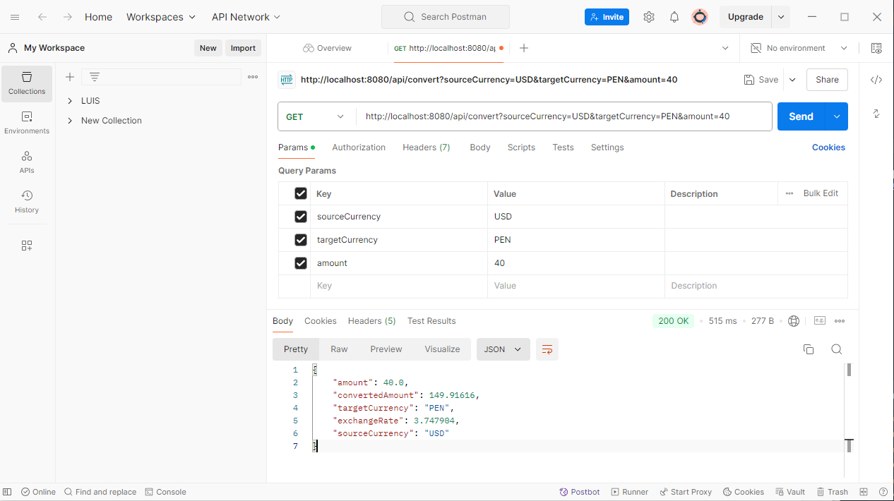

# PRUEBA 

Esto es la prueba tecnica para crear un API para aplicar un tipo de cambio a un monto

## INDICACIONES
Para ejecutar el servicio iniciar este comando:
docker run -p 8080:8080 api-currency

Aquí dejo una prueba en postman, los parametros se hicieron con
@Requestparam para consumir el api
